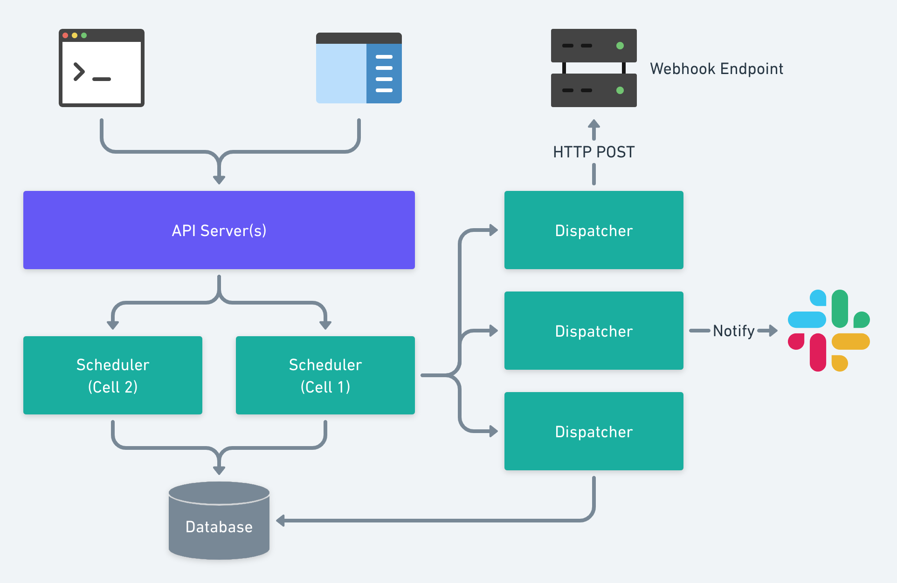

# Design Goals
> NOTE: Document is WIP

The system aims to achieve the following goals:
* Scale _cheaply_ to `O(millions)` of triggers per user
* Scale horizontally with minimum configuration
* Runs on a local environment and on the cloud
* Storage systems are very expensive, use them very efficiently!
* Allow cloud-less deployments (no proprietary cloud provider dependency)


# System Design

 

## Components
- API Server
- Scheduler (sharded - Triggers are assigned to cells)
- Dispatch Worker
  - Executes Webhook
  - Records responses/logs
  - Executes failure/success notifications
- Data Storage
- Distributed Cache

## Storage & Considerations
Where do we store stuff?
> Schedulers will rely on back-pressure from the dispatch queue to report health
- SQL database for users, metadata, triggers, and events.

> To allow the potential for data sharding, we always encode the owner ID in the
object ID to allow for easy shard resolution even.

Object IDs follow the pattern `<prefix>_<ShardedID>`, where `prefix`
is 3-4 ASCII letters indicating the object model. Sharded ID is the
concatenation of `owner numeric-id` and `object unique numeric-id`, both parts
have fixed length.

As described, object IDs allow database sharding by owner-id, and triggers are 
assigned to scheduler cells. The downside is all schedulers to connect to all database
shards, but this enables faster multi-gets. That's a compromise that needs to be
taken.

Do we _really_ need a dispatch queue?
- Dispatch Queue (pub-sub) - w/ back-pressure support (bounded)

I would love to remove the cost of maintaining a queue/pub-sub system, and given
our need for a bounded queue, the internal queuing of dispatch workers is
sufficient. Therefore, I will follow a similar design to how API servers
communicates with schedulers and execute direct dispatches via RPC.


## Triggers (Schedule Storage)
Triggers are mostly static objects but has a few moving bits. The static parts 
are write-once, read many. Expired and paused triggers are stored for archival
but will be pruned periodically to save storage. Active triggers will be loaded
in memory due to the nature of schedulers work.
```
{
  "id": "trg_...",
  "name": ...,
  "cron": "*/2 * * * *",
  "payload": "",
  "on_success": ...
}
```
## Access Patterns
- Fetch an object by ID (sharded by owner ID)
- Scan and load [by state] triggers for a given owner (shard)
- Scan and load [by state] triggers for a given scheduler cell
- Update a single trigger by ID
- Get a trigger by ID
- Record an execution result/log for an event (`evt_<>`)
- Get the last run information for a given trigger
- Get the list of events for a trigger in reverse chronological order

## Shard Leaders
Two options are available to assign cells to schedulers:
1. Internal leader election for schedulers.
2. Manual shard assignment for schedulers (external leader election)

For simplicity, we will go with manual shard assignment and external leader
election (e.g. fixed mapping) in the first iteration.

# Appendix
In case you wonder how some of the design decisions were made:
### Option A
_Using a SQL database + polling_

- Query a database by `shard = X AND updated_at < current_timestamp AND state = 'active'`, 
assuming that all servers are NTP-synced correctly. Then poll the database by 
querying `shard = X AND state = 'active' AND updated_at BETWEEN last_scan AND
current_timestamp`. NOTE: This assumes that shards are assigned to trigger at creation
time.
- Triggers can be moved from one shard to another for rebalancing.

Pros:
- Simple design
- Easy to re-shard data.
- Low probability of missing updates.
Cons:
- Higher reaction latency
- Database load (cost)

### Option B
_Load + subscribe (push)_
- API servers store changes in the database first, then dispatches RPC or
  writes a notification on a pub/sub system to inform the scheduler in the
  corresponding shard.
- Schedulers (on startup) load shard via database query and install triggers.
- Subscribe to notifications dispatched by API servers to the shard leader.
- Each trigger object is versioned (`updated_at` can be used as a version, as
  long as we don't bump it for non-metadata changes)
Pros:
- Cost efficient
- Low reaction latency (real-time)
- Easy to re-shard data.
Cons:
- Increased complexity (and potential need for service mesh, or pub/sub)
- Can miss updates if an update happens between the load and subscribe to
  the pub/sub channel.

However, given that we need queuing or pub/sub system for other parts of the
system, we can leverage their presence to reduce complexity. If we are decided
to use RPC for API Server -> Scheduler communication, we can opt to use manual
mapping in API server.

API server will need to retry dispatching RPCs, or inform the scheduler
that it has missed updates and need to reload once it can reach it.

**Failure scenarios:**

a) API server persists the change in the database, but fail to dispatch the update
to the scheduler (or crash). The update will not be picked up by the shard!

b) API server races on a trigger update with another API server, both
dispatching updates to the scheduler causing out-of-order updates. This assumes
that the database itself is consistent on a per-object-id basis.

### Option C
_Replicated State Machine_
- Each shard is serialized (versioned)
- Commands are stored in a log, replayed, and snapshotted. You know the whole
  drill.
- Scheduler's update latency is bound to the log tail latency (Kafka is pull)

Pros:
- Correctness is guaranteed
- Resilient to missing updates
- API server doesn't need to be aware of scheduler's availability
Cons:
- Hard to reshard
- High reaction latency
- Shard state growth can be problematic (snapshot size)
- Vulnerable to scheduling trigger on a dead shard

### Option D [Winner]
_Perform updates from scheduler_
- RPC from API server -> Scheduler (leader election or static map)
- Scheduler is the ultimate leader for a shard, validates state in memory
- Scheduler install/update triggers in memory _before_ updating the database
- Dead or overloaded scheduler will cause the API server to pick another
  shard.
Pros:
- Scheduler doesn't need pub-sub to subscribe for updates
- Low reaction latency
- Enables load-aware sharding/load-balancing
Cons:
- Schedulers fan-in write to database (low-to-no risk)

**Failure scenarios:**
    - Database writes fails (mitigation: Activate the installed trigger after
      the database write)

Number of schedulers (cluster reconfiguration)
- Adding new shards doesn't automatically rebalance existing triggers
- Stopping/removing shards won't automatically move triggers
- We can monitor shards with no live schedulers, and remap shards if needed (see
  below)

[Warning, complexity ahead]
- This can be fixed by:
  - Assigning the dead shard to one of the live schedulers but this can cause
    massive load imbalance
  - Move to a N:M system, N is the number of virtual shards (hundreds), and M is
    the number of schedulers. An with consistent hashing, we will avoid full
    cluster reload when adding or removing nodes.
  - Nodes subscribe to cluster membership updates (raft group)
  - Nodes need to _wait_ before reacting to cluster configuration changes to
    allow for node restarts without reloading the entire cluster's installed
    triggers. (delay marking node dead by some time)

# Scenarios

### Don't miss a beat!
A scheduler starts up, will it only schedule future occurrences for a
trigger? What if we were down for some time, and that trigger missed one or more
runs for any reason. Do we create events for the past events, we are assuming
that they are somewhat time-sensitive. Dispatch 10 extra webhooks in the same
minute because we missed the last 5 minutes, does that make sense?

### When do we persist events
Somewhat it's dependant on the answer for the previous question. If we don't
want to miss a beat, then we need to guarantee that if an event is scheduled, it
should be attempted at least once!

For simplicity and reliability, we will follow a similar data flow to how we
designed API Server -> Scheduler Cells. Schedulers will execute direct RPCs on
Dispatchers to run webhooks.
